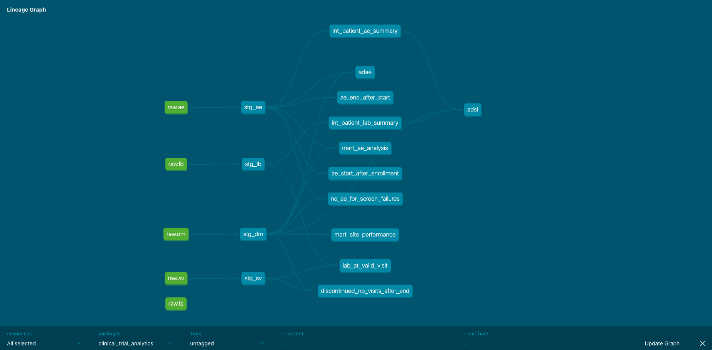
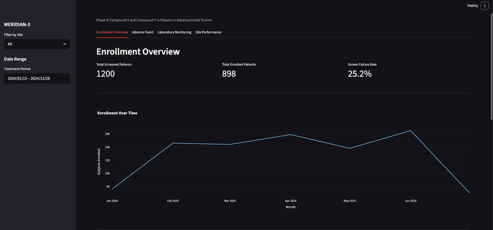
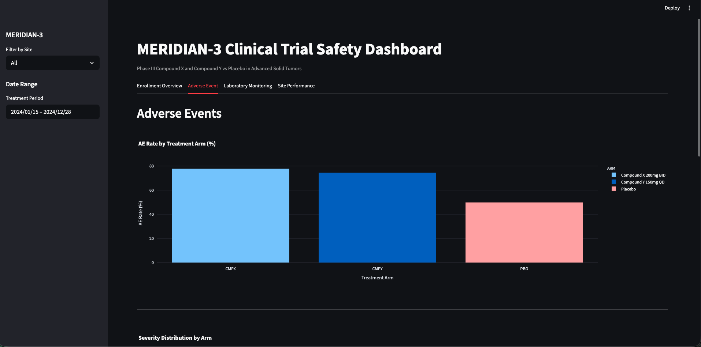
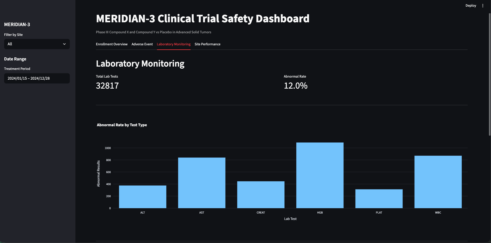
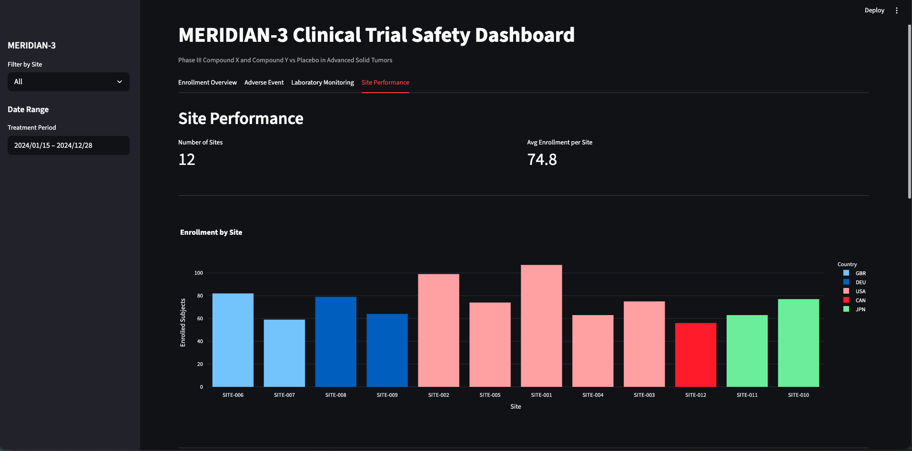

# ClinicalTrialPipe

[](https://github.com/federica896/clinical-trial-pipeline/actions/workflows/pipeline.yml)

**An end-to-end data pipeline for clinical trial safety analytics, covering SDTM transformation through ADaM-inspired analysis datasets to interactive monitoring.**

Built with Python · dbt · DuckDB · Pandera · Streamlit

---

## The Problem

Clinical trial data is messy. It flows in from electronic data capture (EDC) systems, central labs, and investigator sites across multiple countries (each with its own formats, quality issues, and timing). Data managers spend significant time manually cleaning, validating, and transforming this data before it can be used for safety monitoring or regulatory submission.

The typical workflow looks like this:

- Raw data arrives in inconsistent formats with missing values, out-of-window visits, and coding errors
- Validation is done through ad-hoc scripts or manual review, often catching issues late in the process
- Transformation logic lives in SAS programs with little documentation or version control
- Safety teams wait days or weeks for updated reports while data sits in a queue
- When regulators ask "how was this number derived?", tracing back through the pipeline is difficult

## Where This Fits in the Clinical Data Lifecycle

Clinical trial data passes through a well-defined lifecycle before it reaches regulatory reviewers.

```
┌─────────────────────────────────────────────────────────────────────────┐
│                    CLINICAL DATA LIFECYCLE                              │
│                                                                         │
│  ┌──────────────┐     ┌─────────────────────────────────────────────┐  │
│  │ STUDY DESIGN │     │           DATA COLLECTION                   │  │
│  │              │     │                                             │  │
│  │  Protocol    │     │  Sites ──→ EDC System (Medidata/Veeva/      │  │
│  │  CDASH CRFs  │────→│            Oracle InForm)                   │  │
│  │  Standards   │     │  Central Labs ──→ Lab data transfer         │  │
│  │  planning    │     │  ePRO/eCOA ──→ Patient-reported data        │  │
│  │              │     │  Wearables ──→ Sensor/device data           │  │
│  └──────────────┘     └────────────────────┬────────────────────────┘  │
│                                            │                            │
│                                            ▼                            │
│                       ┌─────────────────────────────────────────────┐  │
│                       │         DATA MANAGEMENT                     │  │
│                       │                                             │  │
│                       │  Query management, edit checks,             │  │
│                       │  medical coding (MedDRA, WHODrug),          │  │
│                       │  reconciliation, database lock              │  │
│                       └────────────────────┬────────────────────────┘  │
│                                            │                            │
│  ┌ ─ ─ ─ ─ ─ ─ ─ ─ ─ ─ ─ ─ ─ ─ ─ ─ ─ ─ ─│─ ─ ─ ─ ─ ─ ─ ─ ─ ─ ─ ┐ │
│           THIS PROJECT COVERS THIS SEGMENT  ▼                         │
│  │   ┌─────────────────────────────────────────────────────────┐  │  │
│      │              SDTM TRANSFORMATION                        │     │
│  │   │  Raw/cleaned data ──→ CDISC SDTM domains               │  │  │
│      │  (DM, AE, LB, SV + Define-XML metadata)                │     │
│  │   └──────────────────────────┬──────────────────────────────┘  │  │
│                                 │                                     │
│  │                              ▼                                  │  │
│      ┌─────────────────────────────────────────────────────────┐     │
│  │   │          ADaM-INSPIRED ANALYSIS DATASETS                │  │  │
│      │  SDTM ──→ ADSL (subject-level), ADAE (AE analysis)     │     │
│  │   │  with derivation flags, baseline logic, safety flags    │  │  │
│      └──────────────────────────┬──────────────────────────────┘     │
│  │                              │                                  │  │
│                                 ▼                                     │
│  │   ┌─────────────────────────────────────────────────────────┐  │  │
│      │          ANALYTICS & MONITORING                          │     │
│  │   │  Safety dashboards, quality monitoring, site metrics     │  │  │
│      └─────────────────────────────────────────────────────────┘     │
│  └ ─ ─ ─ ─ ─ ─ ─ ─ ─ ─ ─ ─ ─ ─ ─ ─ ─ ─ ─ ─ ─ ─ ─ ─ ─ ─ ─ ─ ─ ┘ │
│                                            │                            │
│                                            ▼                            │
│                       ┌─────────────────────────────────────────────┐  │
│                       │       REGULATORY SUBMISSION                 │  │
│                       │                                             │  │
│                       │  SDTM + ADaM + Define-XML + TLFs + CSR     │  │
│                       │  ──→ FDA (eCTD) / EMA / PMDA               │  │
│                       └─────────────────────────────────────────────┘  │
└─────────────────────────────────────────────────────────────────────────┘
```

**What it covers:** The SDTM transformation, ADaM-inspired analysis dataset creation, and analytics/monitoring layers: the segment where modern data engineering tools (dbt, DuckDB) offer the most value over legacy SAS-based workflows.

**What it does not cover:**
- EDC system configuration and site data entry (Medidata Rave, Veeva CDMS, etc.)
- Data management activities: query resolution, medical coding, edit checks, reconciliation
- Full ADaM compliance (the analysis datasets follow ADaM conventions but are not submission-ready)
- XPT file generation or Define-XML authoring for regulatory submission
- TLF production (Tables, Listings, Figures) for Clinical Study Reports

The upstream (EDC/data management) and downstream (submission packaging) steps are well-served by existing commercial platforms. The transformation-to-analytics segment is where reproducibility, testability, and traceability are most lacking in current practice, and where modern open-source tools can have the greatest impact.

## The Solution

ClinicalTrialPipe uses modern data engineering practices to improve the SDTM-to-analytics segment of the clinical data lifecycle. It is a fully automated, reproducible pipeline that takes raw CDISC SDTM-aligned clinical trial data and transforms it into validated, analysis-ready datasets with complete lineage and real-time monitoring.

**What it does:**

- **Validates on ingestion**: Pandera schema checks catch data type errors, missing required fields, and invalid coded values before anything enters the database
- **Transforms with full traceability**: dbt models apply standardised business logic (deriving patient age, calculating AE duration, classifying safety risk) with version-controlled SQL that self-documents its lineage
- **Produces ADaM-inspired analysis datasets**: ADSL and ADAE models follow ADaM naming conventions with proper population flags (SAFFL, ITTFL), treatment variables (TRTA/TRTP), and baseline derivations, bridging the gap between SDTM tabulation and statistical analysis
- **Tests continuously**: automated data quality tests to verify referential integrity, value ranges, and clinical logic (e.g., adverse events cannot start before enrollment)
- **Monitors quality over time**: quality reports track validation metrics across pipeline runs
- **Delivers insights immediately**: an interactive Streamlit dashboard gives safety teams real-time visibility into enrollment, adverse events, lab trends, and site performance

**What makes it realistic:**

The synthetic data models a Phase III oncology trial with 1,200 screened subjects across 12 sites, including screen failures, early discontinuations, protocol deviations, missing lab values, and treatment-arm-dependent adverse event rates with the same complexity of real trials.

## Technology Choices and the Regulatory Landscape

This project uses dbt, DuckDB, and Python, not SAS, which remains the dominant tool for regulatory submissions. 

The regulatory landscape is shifting. While FDA and PMDA still require SAS V5 transport (XPT) files for submission, the industry is actively exploring alternatives. CDISC has developed Dataset-XML as a potential replacement, and packages like R's `sdtm.oak` (sponsored by CDISC COSA with contributions from Roche, Pfizer, GSK, Vertex, and Merck) demonstrate that the pharmaverse is moving toward open-source tooling.

This project is positioned for the emerging workflow where:
- **SAS** handles the final-mile submission packaging (XPT generation, Define-XML)
- **Modern data engineering tools** (dbt, Python, cloud databases) handle the transformation, testing, documentation, and monitoring layers, where they offer significant advantages in reproducibility, version control, and collaboration

The goal is to demonstrate that the transformation and analytics layers benefit from modern engineering practices that SAS-based workflows often lack: automated testing, DAG-based dependency management, git-native version control, and self-documenting lineage.

## Who This Is For

- **CROs and pharma companies** evaluating modern data infrastructure for clinical data transformation
- **Data engineering teams** building reproducible, testable clinical data pipelines alongside existing SAS workflows
- **Clinical operations and safety teams** that need faster access to safety signals during study conduct
- **Regulatory and governance professionals** interested in how modern tooling can improve data traceability and auditability

---

## Architecture

```
Raw CSVs (Faker + CDISC SDTM conventions)
    │
    ▼
Python Ingestion Layer -- Pandera schema validation ── Quality log
    │
    ▼
DuckDB (raw schema)
    │
    ▼
dbt Staging Models ── SDTM-aligned: stg_dm, stg_ae, stg_lb, stg_sv
    │
    ▼
dbt Intermediate Models ── patient AE summaries, lab summaries
    │
    ├──→ dbt Mart Models ── site performance, AE analysis by arm
    │
    └──→ dbt ADaM-Inspired Models ── adsl (subject-level), adae (AE analysis)
         with population flags, treatment variables, baseline derivations
              │                                           │
              ▼                                           ▼
    20+ Automated Tests                        Streamlit Dashboard
    (schema + custom singular)              (safety monitoring, 4 tabs)
              │
              ▼
    CI/CD via GitHub Actions
```

## Key Features

- **CDISC SDTM-aligned data model** with proper variable ordering, types, lengths, and controlled terminology
- **Pandera-validated ingestion** catching schema violations before data enters the pipeline
- **ADaM-inspired analysis datasets** (ADSL, ADAE) with population flags and derivation traceability
- **15+ dbt models** across staging, intermediate, mart, and ADaM layers with full DAG lineage
- **20+ data quality tests** including referential integrity, range checks, and custom clinical logic
- **Interactive safety dashboard** with enrollment metrics, AE analysis by treatment arm, site performance, and lab monitoring
- **CI/CD pipeline** running the full pipeline on every push via GitHub Actions
- **Clinical data lifecycle documentation** explaining where this fits in real-world pharma operations

## Tech Stack

| Layer | Tool | Why |
|-------|------|-----|
| Database | DuckDB | Modern analytical DB, zero infrastructure, fast on local data |
| Transformation | dbt-core | Industry-standard transformation framework with built-in testing and docs |
| Validation | Pandera | Schema-based data validation for Python DataFrames |
| Orchestration | Python | Ingestion scripts, data generation, quality monitoring |
| Dashboard | Streamlit + Plotly | Fast interactive dashboards from Python |
| CI/CD | GitHub Actions | Automated pipeline testing on every commit |
| Data Standard | CDISC SDTM + ADaM conventions | Regulatory-grade clinical data standards (FDA, EMA, PMDA) |

---

## Setup

### Prerequisites

- Python 3.11+
- Git

### Quick Start

```bash
# Clone the repository
git clone https://github.com/federica896/clinical-trial-pipeline.git
cd clinical-trial-pipeline

# Create virtual environment
python -m venv venv
source venv/bin/activate  # Windows: venv\Scripts\activate

# Install dependencies
pip install -r requirements.txt

# Generate synthetic data
python scripts/generate_data.py

# Run ingestion (validates + loads into DuckDB)
python scripts/ingest.py

# Run dbt pipeline
cd clinical_trial_analytics
dbt deps
dbt run
dbt test

# Generate documentation
dbt docs generate
dbt docs serve

# Launch dashboard
cd ..
streamlit run dashboard/app.py
```

## Project Structure

```
clinical-trial-pipeline/
├── .github/workflows/pipeline.yml    # CI/CD pipeline
├── dashboard/app.py                 # Streamlit safety dashboard
├── data/
│   ├── raw/                         # Generated SDTM-aligned CSVs
│   └── quality_reports/             # Quality monitoring outputs
│── clinical_trial_analytics/
│       ├── models/
│       │   ├── staging/             # stg_dm, stg_ae, stg_lb, stg_sv
│       │   ├── intermediate/        # Patient AE + lab summaries
│       │   ├── marts/               # Site performance, AE analysis
│       │   └── adam/                # ADaM-inspired: adsl, adae
│       └── tests/                   # Custom singular tests
├── scripts/
│   ├── config.py                    # Trial configuration (all parameters)
│   ├── schemas.py                   # Pandera validation schemas
│   ├── generate_data.py             # CDISC-aligned synthetic data generator
│   ├── ingest.py                    # Pandera-validated DuckDB ingestion
│   └── generators/                  # Domain-specific data generators
│       ├── base.py
│       ├── demographics.py
│       ├── adverse_events.py
│       ├── lab_results.py
│       ├── visits.py
│       └── trial_summary.py
├── docs/
│   ├── data_model_design.md         # Full SDTM data model specification
│   ├── protocol_synopsis.md         # ICH E6(R3) trial design
│   └── data_assumptions.md          # Evidence base for parameters
├── requirements.txt
└── README.md
```

## Data Model

The pipeline models a Phase III oncology trial (ONCO-2024-001) using CDISC domain conventions:

**SDTM Domains (Tabulation):**

| Domain | Description | Record Structure |
|--------|-------------|------------------|
| DM | Demographics | One record per subject |
| AE | Adverse Events | One record per AE per subject |
| LB | Laboratory Results | One record per test per visit per subject |
| SV | Subject Visits | One record per visit per subject |
| TS | Trial Summary | One record per trial parameter |

**ADaM-Inspired Datasets (Analysis):**

| Dataset | Description | Key Derivations |
|---------|-------------|-----------------|
| ADSL | Subject-Level Analysis | Population flags (SAFFL, ITTFL), treatment (TRTA/TRTP), demographics, study duration |
| ADAE | Adverse Event Analysis | Treatment-emergent flags (TRTEMFL), severity, relationship, time-to-onset |

Full data model with variable attributes, controlled terminology, and design decisions: [docs/data_model_design.md](docs/data_model_design.md)

## Testing

```bash
dbt test  # Runs all 20+ tests

# Tests include:
# - Primary key uniqueness and not-null checks
# - Referential integrity (AE patients exist in DM)
# - Value range validation (age 18-100, AE count 0-15)
# - Controlled terminology checks (safety categories, severity values)
# - Custom clinical logic (AEs cannot start before enrollment)
# - Cross-domain consistency (lab results align with actual visits)
# - ADaM derivation checks (population flags consistent with disposition)
```

## Pipeline DAG



## Dashboard

| Enrollment Overview | Adverse Events |
|---|---|
|  |  |

| Laboratory Monitoring | Site Performance |
|---|---|
|  |  |

## Documentation

- [SDTM Data Model](docs/data_model_design.md) — variable attributes, controlled terminology, design decisions
- [Protocol Synopsis](docs/protocol_synopsis.md) — ICH E6(R3)-aligned trial design (ONCO-2024-001 / MERIDIAN-3)
- [Data Assumptions](docs/data_assumptions.md) — evidence base for all synthetic data parameters

## Scope Boundaries and Future Extensions

This project focuses on the transformation-to-analytics segment. Potential extensions that would move it toward full lifecycle coverage:

- **Upstream:** Integration with CDISC ODM/Dataset-XML for EDC data import
- **ADaM compliance:** Full ADLB, ADTTE datasets with LOCF imputation, visit windowing, and parameter derivations
- **Submission readiness:** XPT file generation via Python (using `xport` library), Define-XML authoring
- **TLF automation:** Programmatic generation of Tables, Listings, and Figures from ADaM datasets

## License

MIT